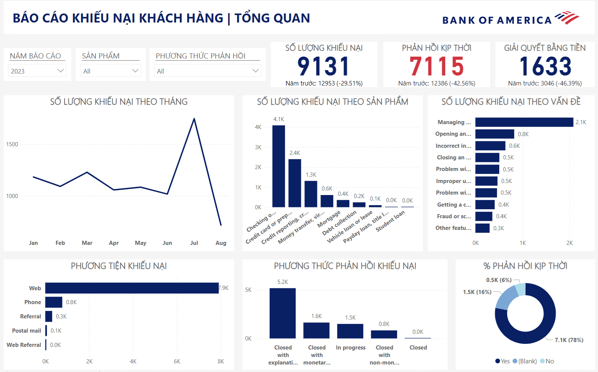

# Cải thiện chất lượng sản phẩm và dịch vụ tại ngân hàng Bank of America qua phân tích khiếu nại của khách hàng

# Tổng quan:
1. Tên dự án
2. Tóm tắt
3. Nguồn dữ liệu
4. Công cụ và phương pháp phân tích
5. Các bước thực hiện
6. Báo cáo
7. Kết quả và phát hiện
8. Kết luận
9. Khuyến nghị
10. Tài liệu tham khảo

# 1. Tên dự án:

**Cải thiện chất lượng sản phẩm và dịch vụ tại ngân hàng Bank of America qua phân tích khiếu nại của khách hàng**

# 2. Tóm tắt:

Dự án nhằm xây dựng báo cáo theo dõi số lượng và xu hướng khiếu nại của khách hàng theo từng chỉ tiêu. Từ đó đưa ra các đề xuất để cải thiện chất lượng sản phẩm và dịch vụ cho Ngân hàng.

# 3. Nguồn dữ liệu:

Dữ liệu khiếu nại của khách hàng về các sản phẩm và dịch vụ tài chính tại ngân hàng Bank of America trong giai đoạn từ năm 2017 đến năm 2023. Bộ dữ liệu có 62,516 bản ghi, bao gồm ngày khiếu nại được gửi đến CFPB, sau đó được gửi đến Bank of America, sản phẩm, vấn đề được đề cập trong khiếu nại và phản hồi của Ngân hàng.
- *Nguồn: [Cục Bảo vệ Tài chính Người tiêu dùng](https://www.consumerfinance.gov/language/vi/)*
- *Thu thập và làm sạch dữ liệu: [mavenanalytics.io](https://www.mavenanalytics.io/data-playground?page=2&pageSize=5)*

# 4. Công cụ và phương pháp phân tích:

- Công cụ:
  * Excel: Khám phá Dữ liệu.
  * Power BI: Tạo báo cáo.
- Phương pháp phân tích: Phân tích mô tả – sử dụng dữ liệu lịch sử để xác định xu hướng.

# 5. Các bước thực hiện:

- Thu thập dữ liệu: Sử dụng dữ liệu đã được làm sạch của mavenanalytics.
- Phân tích: Phân tích xu hướng, tìm thông tin liên quan đến các sản phẩm có nhiều khiếu nại nhất và đưa ra giải pháp để giải quyết vấn đề.
- Trực quan hóa dữ liệu:
  * Tạo báo cáo theo dõi số lượng khiếu nại tài chính trong năm với các danh mục sau: số lượng khiếu nại theo tháng, số lượng khiếu nại theo sản phẩm, số lượng khiếu nại theo vấn đề, số lượng khiếu nại qua phương tiện truyền thông, danh mục phản hồi khiếu nại và tỷ lệ phản hồi kịp thời

# 6. Báo cáo:

## Video báo cáo:
https://github.com/user-attachments/assets/ca5c191d-c003-42b0-9ae1-32a4d8209111

# 7. Kết quả và Phát hiện

- **Số lượng khiếu nại** của khách hàng **có xu hướng tăng theo từng năm**.
- Từ năm 2017 đến năm 2023, **tháng 7 là tháng có xu hướng nhận được nhiều khiếu nại nhất**, khi lên tới gần 6,500 khiếu nại (chiếm hơn 10% tổng số khiếu nại trong toàn bộ giai đoạn).
- **Tài khoản vãng lai hoặc tiết kiệm** là những sản phẩm có nhiều khiếu nại nhất từ ​​khách hàng, tiếp theo là thẻ tín dụng.
- **Quản lý tài khoản** là **vấn đề phổ biến nhất** mà khách hàng gặp phải và các khiếu nại về vấn đề này đều đến từ khách hàng sử dụng sản phẩm tài khoản vãng lai hoặc tiết kiệm. Theo nghiên cứu, khách hàng thường phàn nàn rằng tiền đã bị lấy khỏi tài khoản của họ thông qua **các giao dịch trái phép hoặc gian lận**.
- **Trang web** là kênh nhận được nhiều ý kiến đóng góp của khách hàng nhất (chiếm hơn 70%).
- Ngân hàng **giải quyết khiếu nại chủ yếu bằng cách giải thích** (chiếm hơn 65%).
- **Tỷ lệ phản hồi khiếu nại đúng hạn của ngân hàng cao**, ghi nhận trên 93% trong toàn bộ thời gian.

# 8. Kết luận

- Khiếu nại về sản phẩm và dịch vụ tại ngân hàng Bank of America có xu hướng tăng theo năm, trong đó sản phẩm Tài khoản vãng lai hoặc Tiết kiệm có nhiều sự không hài lòng nhất. Vấn đề mà hầu hết người tiêu dùng gặp phải là các giao dịch trái phép.

# 9. Khuyến nghị

- Ngân hàng cần **tạo và triển khai phần mềm để phát hiện và ngăn chặn các giao dịch thẻ trái phép**, do xu hướng sử dụng thanh toán không dùng tiền mặt của khách hàng ngày càng gia tăng.

# 10. Tài liệu tham khảo:

- Consumer Financial Protection Bureau. (2023). Consumer Response Annual Report 2023. New York: Consumer Financial Protection Bureau.
